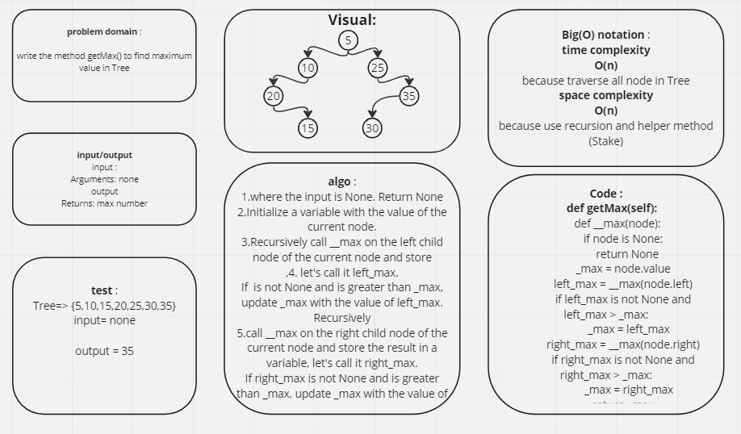

# Challenge Title
Trees

## Whiteboard Process

## Approach & Efficiency

### Add:
* Time complexity: O(log n)
* Space complexity: O(1)

### Contains :
* Time complexity: O(log n) 
* Space Complexity: O(1)

### MaxTree :
* Time complexity: O(n) 
* Space Complexity: O(n)

## Solution
* python python/Trees/trees.py
* pytest python/Trees/test_trees.py 