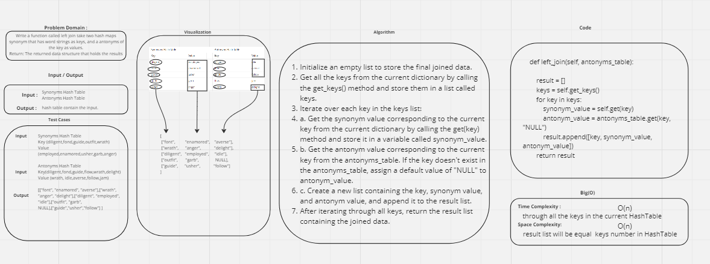

## Code Challenge: Class 33
### Challenge Title : Implement a simplified LEFT JOIN for 2 Hashmaps.
## Author :
### Firas Awadallah
## White Board 

## how run the project 
### to Run  code : 
* python python/hashmap-left-join/hashmap_left_join.py
### to Test code : 
* pytest python/hashmap-left-join/test_hashmap_left_join.py 
## Efficency
### Time: 
* time complexity of  O(n)
### Space:
* space complexity of O(n)