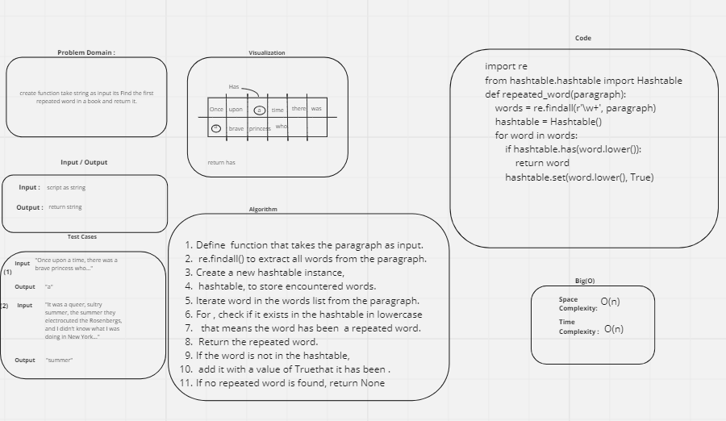

## Challenge Title
### Class 30 ,31: Hash Table ,hashmap-repeated-word
## Author :
### Firas Awadallah
## White Board for repeated-word

## how run the project 
### to Run  code : 
* python python/hashtable/hash_tables.py
* python python/hashtable/repeated_word.py
### to Test code : 
* pytest python/hashtable/test_hashtable.py 
* pytest python/hashmap-repeated-word/test_repeated_word.py 
## Efficency
### Time: 
* function has a time complexity of O(n)
### Space:
* function has a space complexity of  O(n)