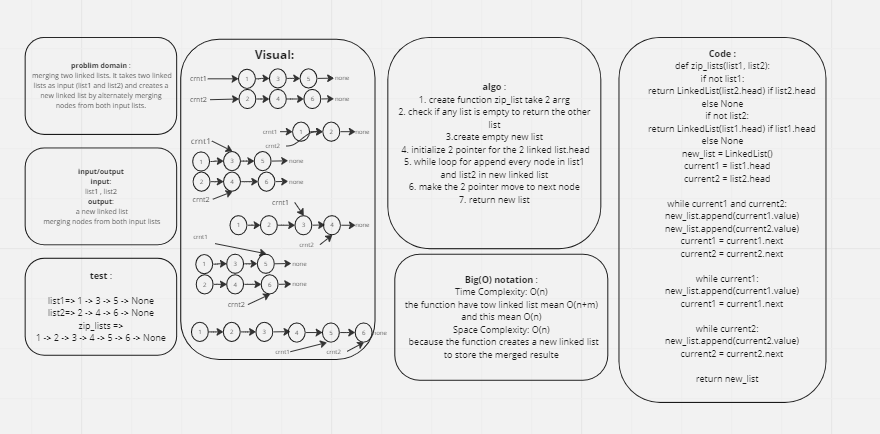

# Challenge Title
linked-list-zip

## Whiteboard Process

## Approach & Efficiency
* The time complexity of this function is O(N+M) => O(n)
* The space complexity of this function is O(N)
## Solution
* To run my application :
python python/linked-list-zip/linked_list_zip/linked_list_zip.py
* To test my code :
pytest python/linked-list-zip/tests/test_linked_list_zip.py 
