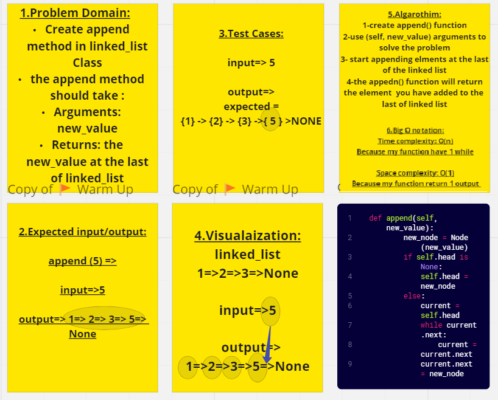
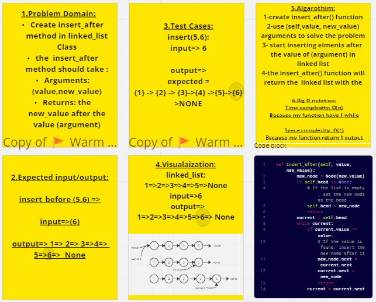

# Challenge Title : Linked List
# Whiteboard Process :
## Code Challenge 05 : insert method

## Code Challenge 06 : append method

## Code Challenge 06 : insert_before method

## Code Challenge 06 : insert_after method

## Approach & Efficiency
linked lists are efficient for inserting and deleting elements at the beginning of the list but less efficient for accessing or searching elements at specific positions. 

## Solution
the Solution in linked_list.py file
python python/linked-list/linked_list/linked_list.py
==> pytest
## auther : Almoutaz Abutaha , Firas Awadallah