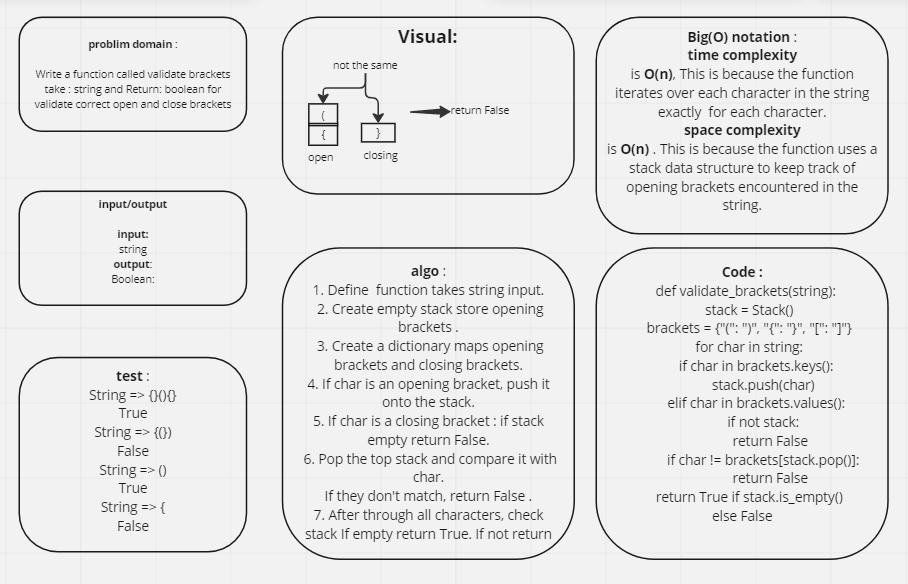

# Challenge Title
## stack_queue_brackets

## Whiteboard Process

## Approach & Efficiency
* time complexity is O(n), This is because the function iterates over each character in the string exactly  for each character. 
* space complexity is O(n) . This is because the function uses a stack data structure to keep track of opening brackets encountered in the string. 

## Solution
* python python/stack-queue-brackets/stack_queue_brackets.py
* pytest python/stack-queue-brackets/test_stack_queue_brackets.py 

