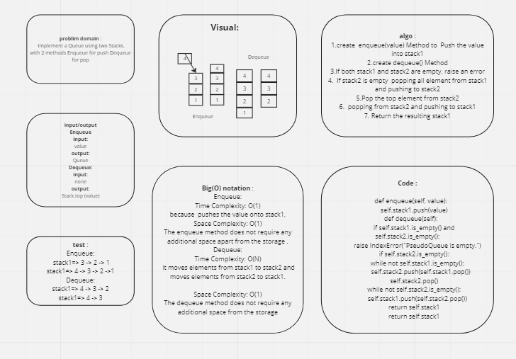

# Challenge Title
stack-queue-pseudo

## Whiteboard Process

## Approach & Efficiency
### Enqueue:
* Time Complexity: O(1)
* Space Complexity: O(1)

### Dequeue:
* Time Complexity: O(N)
* Space Complexity: O(1)

## Solution
* python python/stack-queue-pseudo/stack-queue-pseudo.py
