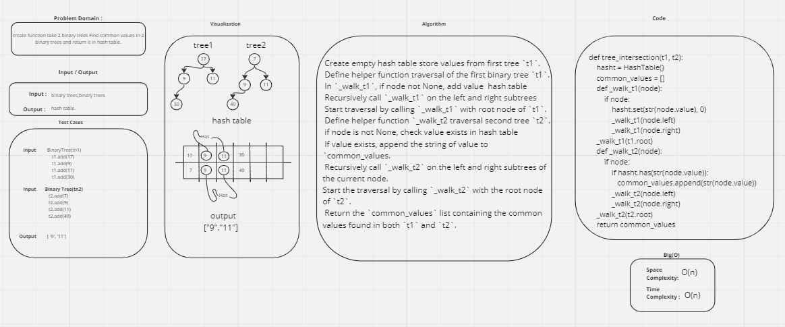

## Challenge Title
### Class 32 tree_intersection
## Author :
### Firas Awadallah
## White Board 

## how run the project 
### to Run  code : 
* python python/tree_intersection/tree_intersection.py
### to Test code : 
* pytest python/tree_intersection/test_tree_intersection.py
## Efficency
### Time: 
* function time complexity of  O(n)
### Space:
* function space complexity of O(n)